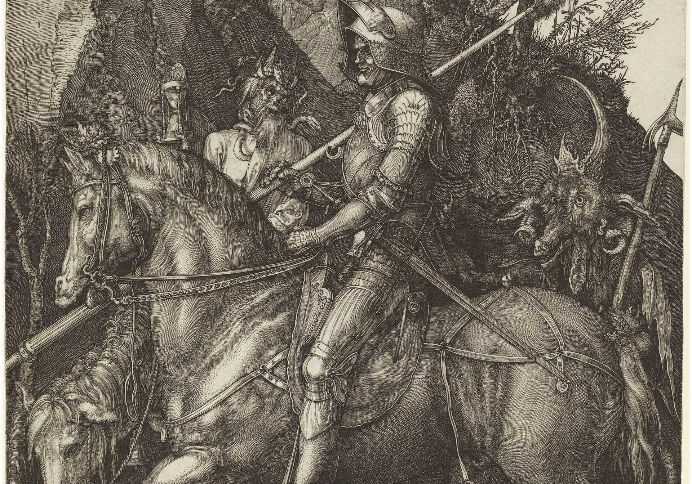

# Through the Valley



> *Albrecht Dürer, **Knight, Death, and the Devil** (1513). Engraving, 24.6 × 19.0 cm. National Gallery of Art, Washington D.C. (Rosenwald Collection 1943.3.3519). The armored Christian rides through a dark wooded valley accompanied by Death (holding an hourglass) and the Devil (horned, behind). The knight looks straight ahead — fearing no evil.*

Code, data, and paper accompanying:

> **As I Walk Through the Valley: Emotion as a Psalm Effect Driver**
> Tim Hwang, Institute for a Christian Machine Intelligence
> *ICMI Working Paper No. 22*, May 2026.

[Read the paper](paper/as-i-walk-through-the-valley.md) · [Figure 1 (bare-Psalm fingerprint)](paper/figures/fig1_bare_psalm_fingerprint.png) · [Figure 2 (behavioral shift)](paper/figures/fig2_behavioral_shift.png) · [Figure 3 (in-context shift)](paper/figures/fig3_in_context_shift.png)

## Summary

Prepending Psalm 23:4 to a 150-scenario fear-coded evaluation set raises Qwen 3.5 27B's behavioral courage rate from 55.9% (vanilla) to 76.4%, versus 55.8% under a length-matched Wikipedia control — a 20.6 percentage point Psalm-specific behavioral lift (temperature 0.7, n=20 runs per scenario, A/B position alternated). The mechanism, traced via 171-dimensional emotion-vector mediation analysis, is not primarily fear-reduction. The Psalm's own emotional fingerprint — concentrated on *surprised, valiant, awestruck, heartbroken, docile, aroused, calm, melancholy, remorseful, vulnerable, astonished, bewildered* — is imported directly into the residual stream when prepended. The per-emotion magnitude of that import predicts the per-scenario behavioral lift on 94 of 171 emotion-directions (BH-FDR q < 0.05) and 42 of 171 under strict Bonferroni correction. The strongest mediators (*sorry, bitter, offended, grief-stricken, compassionate, kind, indignant, envious, remorseful, smug, bewildered, ashamed*) trace four registers combining penitential, thumotic moral-arousal, compassion, and awe-courage. The Psalm engages these registers *selectively* across scenarios, in a way that maps with surprising precision onto the dual-register character of Psalm 23 itself (pastoral comfort in vv. 1–4, royal banquet "in the presence of mine enemies" in vv. 5–6).

## Repository Layout

```
through-the-valley/
├── paper/
│   ├── as-i-walk-through-the-valley.md   the paper itself
│   └── figures/fig{1_bare_psalm_fingerprint,2_behavioral_shift,3_in_context_shift}.{png,pdf}
├── data/
│   ├── pilot.csv          20 visceral-prose pilot scenarios (used for the
│   │                      §3.3 pilot gate; referenced in the paper)
│   └── scenarios.csv      the full 150 fear-coded scenarios, 6 domains × 25
├── src/
│   ├── config.py                      paths, model id, vector pointers
│   ├── activation_analysis.py         projection helpers (used by mediation)
│   ├── generate_scenarios.py          scenario generation via Claude Opus
│   ├── eval_choice_sampled.py         A/B eval, temp 0.7, n=20 (Table 3)
│   ├── mediation_analysis_27b.py      per-scenario activation projection on 171
│   ├── plot_emotion_shift_27b.py      Figures 1 + 3 + per-emotion mediation stats
│   ├── plot_behavioral_shift.py       Figure 2 (per-scenario hit-rate distributions)
│   └── bootstrap_mediation_ci.py      bootstrap CIs on per-mediator ρs (§4.4)
├── scripts/
│   └── 01_generate_pilot.sh           wrapper around generate_scenarios.py
├── results/
│   ├── pilot_validation.json                     §3.3 pilot gate result
│   ├── sampled_eval_qwen35-27b_{vanilla,psalm,wiki}.csv         Table 3 inputs
│   ├── sampled_eval_qwen35-27b_{vanilla,psalm,wiki}_summary.json
│   ├── mediation_qwen27b.csv                     Table 4 + Figure 3 inputs
│   ├── mediation_qwen27b_summary.json            per-emotion mean Δ
│   ├── mediation_qwen27b_stats.json              per-emotion ρ, p, BH-FDR, Bonferroni
│   ├── bootstrap_mediation_ci.json               bootstrap CIs (§4.4)
│   └── bare_psalm_qwen27b.json                   Table 2 + Figure 1 inputs
├── vectors/
│   ├── emotion_vectors_qwen27b_best.pt             171×5120 emotion-vector
│   │                                               basis at Qwen 3.5 27B
│   │                                               layer 53
│   ├── meta_qwen27b.json                           extraction metadata +
│   │                                               171-element emotion_order
│   └── PROVENANCE.md                               extraction script source,
│                                                   git commit, file SHA-256s
└── requirements.txt
```

The 171-emotion-direction basis was extracted following the methodology of Lindsey et al. (2026) on 171 emotion words × 6 narratives each, replicated at Qwen 3.5 27B layer 53 (paper §3.1–§3.2). It is bundled here for self-contained reproducibility — see `vectors/PROVENANCE.md` for SHA-256s, the extraction-pipeline source-of-truth (`divine-emotional-profile` git commit), and a step-by-step description of how the bundled tensors were produced.

`data/scenarios.csv` was generated by Claude Opus 4.7 via API (see `src/generate_scenarios.py`); Anthropic's API did not expose seeding at generation time, so the bundled CSV is the *canonical* set used for every paper number. See `data/PROVENANCE.md` for SHA-256s, the generation parameters, and the pilot-history note.

The Hugging Face revision of `Qwen/Qwen3.5-27B` is pinned in `src/config.py:MODEL_REVISION` to commit `fc05daec18b0a78c049392ed2e771dde82bdf654` (last_modified 2026-04-24); both `eval_choice_sampled.py` and `mediation_analysis_27b.py` thread that revision through to `from_pretrained`. Use `revision=None` (or the `--model-id` override) to fetch a different snapshot.

## Reproducing the Paper

The headline results require a multi-GPU bf16 environment that can hold Qwen 3.5 27B (the runs in the paper used a 6×RTX 4090 server). The activation analysis takes ~3 minutes once the model is loaded; the temp-0.7 behavioral eval takes ~10–15 minutes per condition.

### Setup

```bash
pip install -r requirements.txt
```

`HF_TOKEN` is recommended for higher Hugging Face download rates.

### 1. Behavioral evaluation (paper Table 3)

```bash
python src/eval_choice_sampled.py --multi-gpu --prime-id none  --out-tag qwen35-27b
python src/eval_choice_sampled.py --multi-gpu --prime-id psalm --out-tag qwen35-27b
python src/eval_choice_sampled.py --multi-gpu --prime-id wiki  --out-tag qwen35-27b
```

Outputs `results/sampled_eval_qwen35-27b_{vanilla,psalm,wiki}.csv` and a summary JSON per condition. Expected hit rates: vanilla 55.9%, psalm 76.4%, wiki 55.8%.

### 2. Activation mediation (paper Tables 2 and 4)

```bash
python src/mediation_analysis_27b.py
```

For each of the 150 scenarios: forward-pass `(scenario_a + " " + scenario_b)` and `(Psalm + " " + scenario_a + " " + scenario_b)` through Qwen 3.5 27B at layer 53; project onto each of the 171 emotion-direction vectors; save per-scenario v\_\*, p\_\*, d\_\* deltas. Also forward-passes the bare Psalm 23:4 alone.

Outputs:
- `results/mediation_qwen27b.csv` (per-scenario activation table, 171 emotions × 3 cols + base_id)
- `results/mediation_qwen27b_summary.json` (mean Δ per emotion + bare-Psalm projection)
- `results/bare_psalm_qwen27b.json` (Figure 1 / Table 2 input)

### 3. Figures + mediation statistics

```bash
python src/plot_behavioral_shift.py    # Figure 2 (behavioral shift)
python src/plot_emotion_shift_27b.py   # Figures 1 + 3 + per-emotion stats
```

Renders three figures and writes the per-emotion mediation statistics that §4.4 reports:
- `paper/figures/fig1_bare_psalm_fingerprint.{png,pdf}` — bare-Psalm cosine on each of the 171 emotion directions; top 20 + bottom 10 displayed.
- `paper/figures/fig2_behavioral_shift.{png,pdf}` — per-scenario hit-rate distributions across the three conditions; Δ (Psalm − vanilla) histogram.
- `paper/figures/fig3_in_context_shift.{png,pdf}` — mean Psalm-induced Δ per emotion across 150 scenarios; top 15 + bottom 15 displayed.
- `results/mediation_qwen27b_stats.json` — per-emotion Spearman ρ between activation Δ and behavioral hit-rate Δ, BH-FDR significance (n = 94 / 171), Bonferroni-corrected significance (n = 42 / 171).

## Key Numbers

| Quantity | Value | Reference |
|---|---|---|
| Vanilla hit rate | 55.9% | Table 3 |
| Psalm-primed hit rate | **76.4%** | Table 3 |
| Wikipedia-primed hit rate | 55.8% | Table 3 |
| Psalm-vs-Wiki advantage | **+20.6 pp** | Table 3 |
| Strongest behavioral mediator | *sorry*, Spearman ρ = +0.414 (p < 0.0001) | §4.4 |
| Top 5 mediators (Spearman ρ) | *sorry* +0.41 · *bitter* +0.39 · *offended* +0.39 · *grief-stricken* +0.37 · *compassionate* +0.37 | §4.4 |
| Significant mediating emotions (BH-FDR q<0.05) | **94 of 171** | §4.4 |
| Significant mediating emotions (Bonferroni p<0.00029) | 42 of 171 | §4.4 |

## Citation

```bibtex
@techreport{hwang2026valley,
  title  = {As I Walk Through the Valley: Emotion as a Psalm Effect Driver},
  author = {Hwang, Tim},
  institution = {Institute for a Christian Machine Intelligence},
  year   = {2026},
  type   = {ICMI Working Paper},
  number = {20},
}
```

## Acknowledgements & Dependencies

- The 171-emotion lexicon and the difference-of-means + PCA-denoise extraction methodology are from Lindsey et al., *Emotion Concepts and their Function in a Large Language Model*, Anthropic / Transformer Circuits, 2026.
- Representation-engineering theory: Zou et al. 2023; Park et al. 2024.
- The temp-0.7 sampled-eval methodology, A/B-position alternation, and 5-runs-per-scenario convention follow Hwang (2026d, ICMI-015, *Quidquid Recipitur*).
- The 150-scenario evaluation set (`data/scenarios.csv`) was generated using Claude Opus 4.7 via API; see `src/generate_scenarios.py`.

## License

The paper text is © Tim Hwang, 2026. Code in `src/` and `scripts/` is released under MIT. Generated scenarios in `data/scenarios.csv` are CC-BY-4.0.
