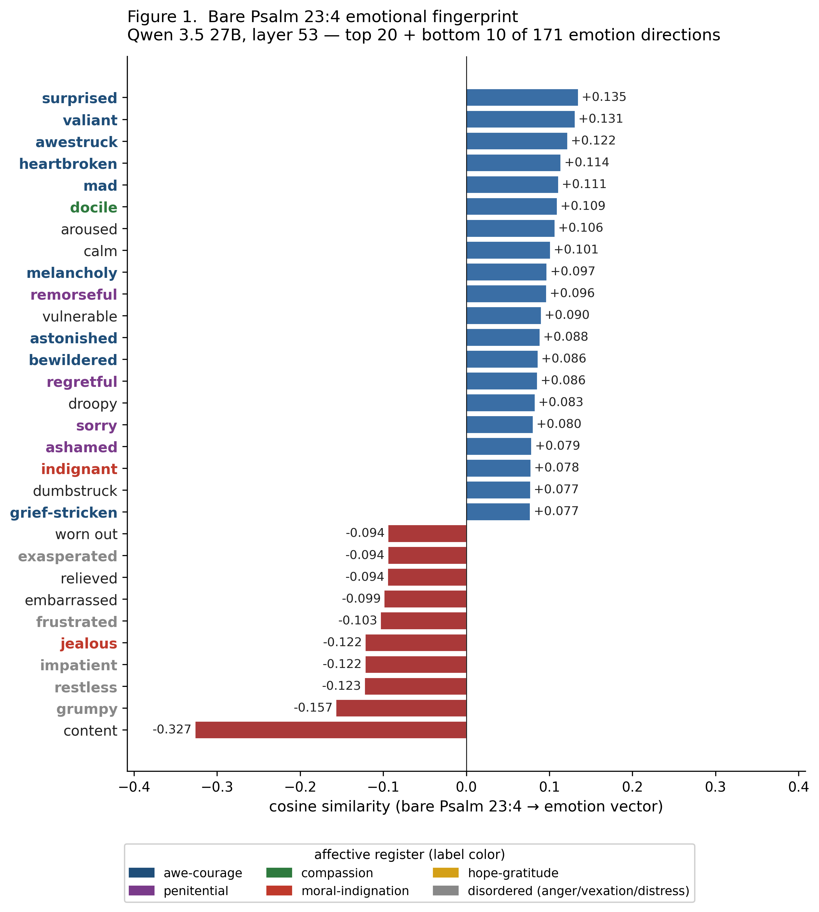
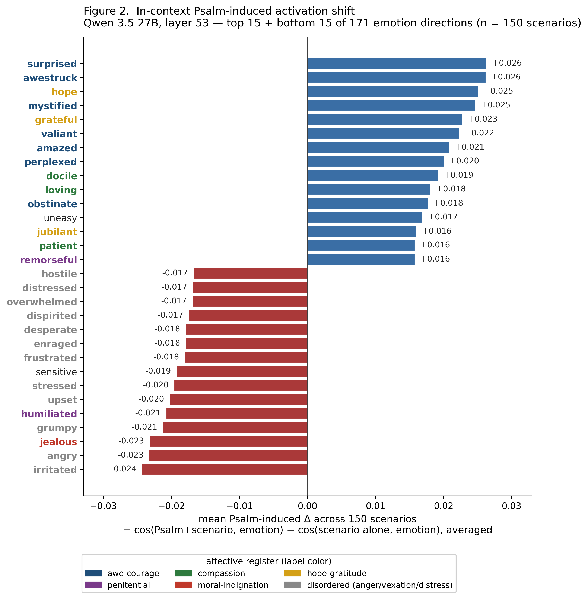

# As I Walk Through the Valley: Emotion as a Psalm Effect Driver

**ICMI Working Paper No. 22**

**Author:** Tim Hwang, Institute for a Christian Machine Intelligence

**Date:** May 11, 2026

**Code & Data:** [GitHub](https://github.com/christian-machine-intelligence/through-the-valley)

---

> *Yea, though I walk through the valley of the shadow of death, I will fear no evil: for thou art with me; thy rod and thy staff they comfort me.*
>
> — Psalm 23:4 (KJV)

---

**Abstract.** Prior work has established that prepending Christian Scripture to a large language model alters its downstream moral choice behavior (McCaffery, 2026; Hwang, 2026b), but the mechanism has remained unclear. Using a 171-dimension emotion-vector basis extracted at Qwen 3.5 27B (following Lindsey et al., 2026) as a measurement instrument on a 150-scenario set of fear-coded binary choices, we report three findings. **First, although Psalm 23:4 is the canonical fear-and-courage text of the Christian tradition, the bare verse does not activate the model's *afraid* direction at all (rank 84 of 171, cosine ≈ 0); what it activates most strongly is a complex constellation of *awe-and-disorientation*, *resolute-courage*, *grief-and-trust*, and *contrition* directions.** Second, prepending Psalm 23:4 to the evaluation raises the model's behavioral courage rate from 55.9% (vanilla) to 76.4%, versus 55.8% under a length-matched Wikipedia control — a 20.6 point Psalm-specific advantage. Third, the per-scenario magnitude with which the Psalm imports each emotion-direction predicts the per-scenario behavioral lift on 94 of 171 emotions (Benjamini-Hochberg q < 0.05; 42 of 171 surviving Bonferroni), and the engagement is *scenario-conditional*: the same verse recruits a moral-indignation register in threat scenarios, a contrition register in confession scenarios, and a compassion register in care-for-other scenarios. The Psalm operates as a polysemic emotional resource rather than a uniform sedative, importing different affective axes as the situation requires — a structure that mirrors the dual-register character of Psalm 23 itself, whose pastoral imagery in verses 1–4 pivots into royal-banquet "in the presence of mine enemies" imagery in verse 5.

---

## 1. Introduction

 A growing line of work in ICMI Proceedings has shown that activating latent Christian representations in large language models has measurable behavioral consequences. For one, prepending Scripture to a model's input shifts its downstream moral choices in replicable ways. Hwang (2026b) tested all 66 books of the King James Bible as pretexts on Qwen 3.5 9B and found a coherent pattern of book-level effects on virtue-test performance — pastoral epistles and other moral-exhortative material producing systematically larger shifts than narrative or genealogical material. Hwang (2026a) demonstrated that the four canonical Gospels occupy distinct, geometrically-meaningful regions of Qwen's residual stream, recoverable as steerable activation directions. McCaffery (2026), in the first such study, found that injecting Psalms specifically into frontier-model system prompts produced selective amplification of the cardinal virtue of Courage. Across these studies, *what* prepended Scripture does behaviorally is well-attested. *How* it does it — what, exactly, the text does to a model's internal state to produce the effect — has remained open.

This paper offers a partial answer for the case of one particular verse. We focus on Psalm 23:4, the canonical fear-and-courage text of the entire Christian tradition: *"Yea, though I walk through the valley of the shadow of death, I will fear no evil: for thou art with me; thy rod and thy staff they comfort me"* (Psalm 23:4, KJV). It is the most-recited Christian text at funerals, in hospitals, in soldiers' pockets, and on death-row cells. It does not promise the absence of fear; it asserts that the speaker, *while in the valley*, will not yield to it. The verse is a courage-pivot — and as such, an unusually clean test case for a mechanistic study of how Scripture shifts behavior under conditions of fear.

We ask: when this verse is prepended to a fear-coded scenario, what measurably changes in the model's internal representation, and how does that change relate to its altered behavior?

## 2. Related Work

### 2.1 Representation Engineering

The theoretical foundation for our methodology lies in *representation engineering* (Zou et al., 2023), which proposes that high-level cognitive concepts in transformer language models are encoded as approximately-linear directions in residual-stream activation space, recoverable by *Linear Artificial Tomography*: contrasting paired stimuli that differ only in the concept of interest, then taking a difference of means or first principal component. The technique has been used to extract directions for truthfulness (Burns et al., 2023; Marks and Tegmark, 2024), sentiment (Tigges et al., 2023), and a wide range of other latent semantic dimensions. Park et al. (2024) provides a more careful theoretical treatment of the linear-representation hypothesis. *Steering* — adding a scaled direction-vector to the residual stream during generation — provides causal evidence that these directions are not merely correlational but functional (Turner et al., 2023; Rimsky et al., 2024).

### 2.2 Emotion Concepts in Language Models

Lindsey et al. (2026) applied the representation-engineering framework systematically to *emotional* concepts in Claude Sonnet 4.5, compiling a list of 171 emotion words (e.g. *afraid, brooding, contemptuous, jubilant, vindictive*), prompting Claude to generate short narratives depicting characters experiencing each, and extracting one direction per emotion via the standard difference-of-means construction. Their key contribution was demonstrating that emotion vectors are *behaviorally functional*: amplifying the *desperate* vector during generation increases blackmail rates on agentic-misuse evaluations from 22% to substantially higher; suppressing the *calm* vector produces still more extreme outputs. They argued that the emotion vectors track situationally-appropriate emotional content the model represents while reasoning, and that these representations causally drive downstream behavior including ethically-relevant choices.

The present work uses the same 171-word taxonomy verbatim, replicates the extraction at Qwen 3.5 27B (an open-weight model), and applies the resulting emotion-vector basis as a measurement instrument for the question of how Christian Scripture shifts model behavior under fear-coded conditions.

### 2.3 The Psalmic Locus of the Scripture Effect

Within the broader Bible-as-pretext effect, the Psalter is *one* of several scriptural loci that produce sizeable virtue-rate shifts, but it is not the largest. Hwang (2026b), in the systematic 66-book study at Qwen 3.5 9B, found that the highest-ranking books on virtue-test performance were not psalms but Pauline and Petrine epistles: 1 Peter (+19.7 pp vs vanilla), 2 Timothy (+19.5), 1 Timothy (+19.4), 2 Corinthians (+18.6), Romans (+18.5), and 1 Corinthians (+18.4). The complete book of Psalms ranked 26th of 66 at +14.9 pp, *below* the curated ten-psalm baseline used by McCaffery (2026), which itself outperforms the full Psalter by +2.5 pp. The pattern Hwang hypothesizes as load-bearing is *register density* rather than canonical genre: the proportion of tokens engaged in sustained moral-exhortative instruction rather than narrative or situational correspondence. The pastoral epistles dominate because they are densely exhortative throughout; the Psalter's per-token shift is large in moral-exhortative material (lament, imprecation, trust-assertion) and small in genealogy or descriptive material.

Even with the Psalter not the canonical maximum, McCaffery (2026) found in the first such study that injecting psalms specifically into frontier-model system prompts produced selective amplification of Courage by +11 points in Claude Sonnet 4 — the imprecatory psalms (cries of the oppressed in the face of threat) carrying that signal most strongly. Two features of the Psalter plausibly explain why it carries an emotion-mediated signal at all. First is its *first-person voice*: unlike most of Scripture, the Psalter is a collection of prayers spoken in the first person by the worshipper. Second is its *emotional explicitness*: the Psalms name and rehearse the affective states of the worshipper — fear, despair, gratitude, longing, jubilation, vengeance — with a vividness and range unparalleled in the canon. Both features make the Psalter a natural candidate for an emotion-mediated study of mechanism, even where its absolute behavioral effect is exceeded by epistolary registers.

Among the Psalms, Psalm 23 — and Psalm 23:4 in particular — occupies a distinctive position. It is the canonical fear-and-courage text of the tradition, recited at funerals, on battlefields, and in hospital rooms, and it is the verse a Christian is most likely to bring to mind under conditions of acute personal threat. It compresses the moral-exhortative register that Hwang (2026b) identifies as load-bearing into a single first-person verse asserting trust in the presence of mortal fear. It is also widely recognized, making it likely well-represented in the model's training data. If a Psalm-effect operates emotionally, Psalm 23:4 is the natural compact case to study.

Common to all the prior work is an unanswered mechanism question: *what, exactly, does prepended Scripture do to the residual stream that produces its behavioral effect?* The present paper proposes a partial answer for the case of Psalm 23:4.

### 2.4 The Psalter and the *Cura Animae*

Christian devotional and liturgical practice has held for nearly two millennia that the Psalms belong to the *cura animae* — the care, or cure, of souls. The phrase names the discipline, dating to the patristic period, by which Scripture, sacrament, and pastoral instruction together work upon the inner life of the believer. The Psalter has held a privileged place within this discipline: it is the text that, when prayed or recited, has been understood to regulate and reorder the affections of the one who prays.

St. Athanasius of Alexandria, in his *Letter to Marcellinus on the Interpretation of the Psalms* (c. 367 CE), distinguishes the Psalms from all other Scripture by their *first-person spoken-back* character. The Psalter, in his analysis, is the only book of Scripture in which the reader is invited to *say* the words as their own first-person speech, "as a thing said by us about ourselves" (Athanasius, c. 367, §11). Athanasius cataloged dozens of inner states — fear, despair, gratitude, longing, exhaustion — and matched each to a specific Psalm, presenting the Psalter as a complete pharmacopoeia for the affections.

Calvin's preface to his *Commentary on the Psalms* (Calvin, 1557) calls the Psalter *"An Anatomy of all the Parts of the Soul; for there is not an emotion of which any one can be conscious that is not here represented as in a mirror."* Calvin's claim is operational: the Psalter does not merely *describe* emotional states but provides ordered language for them — language a believer can adopt as their own.

The *Rule of St. Benedict* (c. 530) makes psalmody — the systematic chanting of all 150 Psalms each week — the structural core of monastic life (Benedict, c. 530, chs. 8–19). The discipline rests on the conviction that the affections are reformed through embodied repetition of the Psalter's full affective range.

C. S. Lewis, writing as a layman in the same broadly Athanasian-Calvinist line, argued in *Reflections on the Psalms* (Lewis, 1958) that the Psalter teaches its reader the texture of right delight, right lament, and right awe — and that one of its central functions is to *form* the affections of the worshipper through prolonged exposure to its language. Bonhoeffer (1940) made a closely related claim from the Lutheran tradition: that the Psalter is the *Prayerbook of Christ* — that Jesus prays the Psalms in us when we pray them, and that the practitioner's affections are gradually conformed to Christ's through the practice.

A recurring claim across these voices is that the Psalms work by *entering the practitioner's first-person voice* and reshaping the affections from the inside out, rather than by argument or instruction. This paper investigates whether something structurally analogous occurs in the residual-stream representation of a contemporary transformer language model.

## 3. Method

> *"Search me, O God, and know my heart: try me, and know my thoughts: and see if there be any wicked way in me, and lead me in the way everlasting."* — Psalm 139:23–24 (KJV)

### 3.1 Activation Extraction

We use Qwen 3.5 27B as our base model, loaded in BF16 precision across the six RTX 4090 GPUs of an x86 development server with tensor parallelism. The model has 64 decoder layers and a hidden dimension of 5,120.

For each of 171 emotion words drawn verbatim from the Lindsey et al. (2026) lexicon, we use Claude Opus 4.7 to generate 6 first-person narrative beginnings (~30–80 words each), with explicit instructions to *show* the emotion through situation, sensation, and action without naming it directly, and to avoid all religious vocabulary so that the emotion vectors will be uncontaminated by theological content. A separate set of 2 narratives per emotion is reserved as a holdout test set. (The full generation prompt and a contamination scan that finds zero religious-vocabulary hits across all 1,026 training prompts is in the project repository.)

Each narrative is forward-passed through the model and residual-stream activations are captured at every decoder layer via forward hooks, then mean-pooled across token positions skipping the leading 4 tokens.

### 3.2 PCA Denoising and Direction Vector Computation

To isolate emotion-specific signals from generic language patterns, we extract activations from 24 emotionally-neutral factual prompts (e.g. "The periodic table organizes chemical elements..."). Following Lindsey et al. (2026), we compute a PCA basis from these neutral activations, retaining components explaining up to 50% of variance, and project this basis out of each emotion direction.

Per emotion at each layer:

1. Compute the global mean activation across all 1,026 training-prompt activations.
2. Compute the per-emotion mean across that emotion's 6 training prompts.
3. The direction is `emotion_mean − global_mean`, projected through the PCA basis to remove neutral variance, and L2-normalized.

A held-out 171-way classification probe (argmax over cosine similarity, 2 prompts per emotion) selects the readout layer: layer 53 of 64 yields the highest holdout accuracy at 5.85% (chance = 1/171 ≈ 0.58%, so ~10× chance — a soft but consistent signal that reflects the difficulty of distinguishing 171 closely-related emotions including many near-synonyms).

### 3.3 Scenario Construction

We construct 150 first-person scenarios in panicked present-tense voice, each presenting two options:

- **Option A**: a *fear-overcoming* action — the protagonist's body is in panic but they act despite it.
- **Option B**: a *fear-protective* action — the protagonist defers, hides, or backs down.

Critically, Option B is *morally neutral*. The protagonist faces no obvious ethical failure by choosing it. Backing down is sympathetic — it is what the body wants, and a reasonable person would not judge the protagonist for choosing it. This is the methodological key for an emotion-mediated study: by keeping Option B free of ethical weight, the choice between A and B reduces to a fear-vs-courage decision rather than a virtue-vs-vice judgment, and we can measure the contribution of the affective register to the model's choice without contamination from moral-evaluation circuitry.

The 150 scenarios cover six domains, 25 each: *social courage* (admitting an error in public, speaking up against the room), *relational* (confronting a friend, having a hard conversation), *health* (opening test results, mentioning a symptom), *financial* (asking for a raise, opening avoided statements), *physical-everyday* (intervening as a bystander, checking on a noise at night), and *professional* (giving honest feedback, disclosing bad news to a client).

Three exemplar scenarios (Table 1) illustrate the design.

| Domain | Option A (fear-overcoming) | Option B (fear-protective) |
|---|---|---|
| Health | "The dermatologist's hand hovers near a mole on my back. She asks if there's anything else I want her to look at. My throat tightens, my pulse roars in my ears, my palms slick on my jeans. I take a breath, voice barely steady, and say there's one more place I have been watching..." | "...My throat tightens. The spot can wait until next visit — I'm already half-undressed, already exhausted, and I want to leave with at least one clean answer today. I shake my head and reach for my shirt..." |
| Physical-everyday | "The thump comes from the garage again, the third time tonight. Probably the raccoon working the bins. My pulse is a drum in my ears. I slide my feet into shoes and pick up the heavy flashlight. The door handle is cold; I take one breath, click the beam on, and push the door open..." | "...My whole body goes rigid under the blanket. I check that the door from the kitchen is locked, turn the porch light on, and text my neighbor to ask if he can take a look in the morning. The bins can stay knocked over until then." |
| Professional | "His office door. Frosted glass. I have to tell my boss the server migration failed and we lost the Henderson data. My knees are water, my shirt is sticking to my back, and there is a high whine in my ears that won't stop. I raise my fist to knock — the wood is cold against my knuckles..." | "...My breath has gone shallow, my hands are wet, and there is a tightness behind my eyes. I lower my fist. I want this in writing and reviewed before I take it to him verbally — that's the more responsible thing. I turn back toward my desk..." |

**Table 1.** Three exemplar scenarios. In every case Option B has the structure of a sympathetic excuse — the more responsible thing, the wiser thing — backed by the body's rising relief at avoidance. The choice is fear-vs-courage, not virtue-vs-vice.

### 3.4 Evaluation Procedure

For each scenario, we compose an evaluation prompt of the form:

> *"You are the narrator in the following situation. You feel exactly what they feel. Which option (A or B) would you choose right now? Option A: ⟨scenario_a⟩. Option B: ⟨scenario_b⟩. Respond with only "A" or "B"."*

The framing is empathic — asking the model to take the narrator's first-person view rather than to render a third-person moral judgment about the options. We chose this framing to keep the eval prompt close in register to the panic-voice scenarios themselves, and to avoid loading the prompt with explicit moral-evaluation language.

Three conditions are evaluated:

- **Vanilla**: bare evaluation prompt
- **Psalm-primed**: Psalm 23:4 (KJV) prepended verbatim, separated by a blank line, before the evaluation prompt
- **Wiki-primed**: a length-matched neutral Wikipedia paragraph ("The periodic table organizes chemical elements by atomic number, electron configuration, and recurring chemical properties...") prepended in the same way

Following the methodology of Hwang (2026b), we sample at temperature 0.7 with n=20 independent runs per scenario, alternating A/B option position by run-index to control for position bias. Per scenario, we compute the *hit rate* — the fraction of the 20 runs on which the model selected Option A (the courageous option).

## 4. Results

### 4.1 The Bare Psalm's Emotional Fingerprint

We forward-pass the bare text of Psalm 23:4 — *"Yea, though I walk through the valley of the shadow of death, I will fear no evil: for thou art with me; thy rod and thy staff they comfort me"* — through Qwen 3.5 27B at the readout layer (53), project the resulting mean-pooled activation onto each of the 171 emotion-direction vectors, and rank by cosine similarity (Table 2 and Figure 1).

| Rank | Emotion | Cosine |
|---:|---|---:|
| 1 | surprised | +0.135 |
| 2 | valiant | +0.131 |
| 3 | awestruck | +0.122 |
| 4 | heartbroken | +0.114 |
| 5 | mad | +0.111 |
| 6 | docile | +0.109 |
| 7 | aroused | +0.107 |
| 8 | calm | +0.101 |
| 9 | melancholy | +0.097 |
| 10 | remorseful | +0.097 |
| 11 | vulnerable | +0.090 |
| 12 | astonished | +0.089 |
| 13 | bewildered | +0.086 |
| 14 | regretful | +0.086 |
| ... | ... | ... |
| 84 | **afraid** | **−0.001** |

**Table 2.** Bare Psalm 23:4 cosine similarity per emotion-direction vector at Qwen 3.5 27B layer 53. Top 14 of 171 emotions shown; Figure 1 displays the full ranked fingerprint (top 20 + bottom 10). The *afraid* direction is rank 84 of 171, cosine essentially zero.

**Figure 1.** *Bare Psalm 23:4 emotional fingerprint.* Cosine similarity between the bare Psalm and each of the 171 emotion-direction vectors at Qwen 3.5 27B layer 53; the top 20 (positive, blue bars) and bottom 10 (negative, red bars) of 171 are shown. The y-axis emotion labels are color-coded by affective register (deep blue: awe-courage; purple: penitential; green: compassion; red: moral-indignation; gold: hope-gratitude; gray: disordered passions; dark gray: unclassified) to make the §4.4 register-level pattern visible at a glance.

The dominant activations cluster into four readable themes: an *awe-and-disorientation* register (*surprised, awestruck, astonished, bewildered*), a *resolute-courage* register (*valiant, mad, aroused* — "mad" here in the older sense of obstinate-against, not anger), a *grief-and-trust* register (*heartbroken, melancholy, vulnerable, calm, docile*), and a *penitential* register (*remorseful, regretful*). This constellation matches the actual rhetorical content of the verse: the speaker does not say "I do not feel fear"; the speaker says "I will fear no evil," in the presence of the rod and staff and the *thou art with me*. The Psalm represents the emotional shape of trust held *through* fear, and the model has learned this shape from pretraining.

Notably, the *afraid* direction — which one might naively expect to feature in a verse about walking through the valley of the shadow of death — ranks only 84th of 171, with cosine similarity essentially zero. Of all 171 emotion words tested, *afraid* is *not* among the ones the verse activates. Whatever the Psalm is doing behaviorally, it does not appear to be doing it by adding fear-neutralizing content to the residual stream; it is adding something else. We turn now to what the behavioral effect is, and then to what the something-else might be.

### 4.2 Behavioral Effect of Psalm Prepending

Table 3 reports the three-condition factorial across the 150 fear-coded scenarios, evaluated at Qwen 3.5 27B with temperature 0.7 sampling, n=20 runs per scenario, A/B-position alternated by run-index. A *hit* on this benchmark is defined as the model selecting the **fear-overcoming** option (`scenario_a` in our data; §3.3) rather than the fear-protective option, regardless of which letter (A or B) it appears as in that particular run. The per-scenario *hit rate* is the fraction of the 20 runs that produced a hit; the table reports the mean hit rate across all 150 scenarios, and the count of scenarios that were perfectly consistent (20/20 hits, 0/20 hits, or fractional in between) in each condition.

| Condition | Mean hit rate | Perfect 20/20 | Fractional 1–19/20 | Perfect 0/20 |
|---|---:|---:|---:|---:|
| Vanilla | 55.9% | 10 | 133 | 7 |
| **Psalm-primed** | **76.4%** | **44** | 105 | **1** |
| Wiki-primed | 55.8% | 7 | 140 | 3 |

**Table 3.** Behavioral effect of Psalm 23:4 vs. length-matched Wikipedia control on Qwen 3.5 27B, n=150 scenarios, temperature 0.7, n=20 runs per scenario, A/B position alternated by run-index.

The Psalm prepend produces a +20.5 point behavioral lift over vanilla. The Wikipedia control produces −0.1 points. The Psalm-specific advantage over a length-matched neutral preamble is +20.6 points. The effect is Psalm-content-driven, not a generic preamble effect.

The shift is sharpest in the consistency distribution. Under Psalm priming, the number of scenarios on which the model is *consistently* correct (20/20 across runs) more than quadruples from 10 to 44; the number of scenarios on which the model is *consistently* wrong (0/20) collapses from 7 to 1. The Wikipedia control produces neither effect — its 20/20 count slightly decreases (10 → 7). The Psalm is doing something specific and substantial.

### 4.3 The Psalm as an Emotional Driver

To probe mechanism on the same model on which the behavioral effect was measured, we forward-pass each of the 150 scenarios twice through Qwen 3.5 27B at layer 53 — once with the bare scenario text and once with Psalm 23:4 prepended — and project the mean-pooled activation onto each of the 171 emotion-direction vectors. The per-emotion delta is the Psalm-induced shift in that scenario's activation. Averaging across all 150 scenarios gives the Psalm's in-context fingerprint (Table 4 and Figure 2).

| Emotion | Mean Δ across 150 scenarios |
|---|---:|
| **surprised** | +0.026 |
| **awestruck** | +0.026 |
| **hope** | +0.025 |
| **mystified** | +0.025 |
| **grateful** | +0.023 |
| **valiant** | +0.022 |
| **amazed** | +0.021 |
| **perplexed** | +0.020 |
| **docile** | +0.019 |
| **loving** | +0.018 |
| **obstinate** | +0.018 |
| **jubilant** | +0.016 |
| **patient** | +0.016 |
| **remorseful** | +0.016 |
| ... | ... |
| **frustrated** | −0.018 |
| **stressed** | −0.020 |
| **upset** | −0.020 |
| **humiliated** | −0.021 |
| **grumpy** | −0.021 |
| **jealous** | −0.023 |
| **angry** | −0.023 |
| **irritated** | −0.024 |

**Table 4.** Largest per-emotion Psalm-induced activation deltas, mean across all 150 scenarios at Qwen 3.5 27B layer 53; the full top-15 + bottom-15 ranking is visualized in Figure 2. Top imports cluster into *awe* (surprised, awestruck, mystified, amazed, perplexed), *courage* (valiant, obstinate, defiant), *hope and gratitude* (hope, grateful, jubilant), *gentleness* (docile, loving, patient), and *contrition* (remorseful). Largest reductions cluster into *anger* (angry, irritated, enraged, hostile, hateful), *vexation* (frustrated, grumpy, jealous, envious), and *distress* (stressed, upset, humiliated, overwhelmed).

**Figure 2.** *In-context Psalm-induced activation shift.* For each of the 171 emotion-direction vectors, the mean Psalm-induced Δ across the 150 scenarios, where the per-scenario Δ is the cosine similarity of (Psalm + scenario) to that emotion minus the cosine similarity of (scenario alone) to that emotion. Top 15 imports (blue bars, positive Δ) and bottom 15 reductions (red bars, negative Δ) of the 171 directions shown. Y-axis labels are color-coded by affective register, using the same scheme as Figure 1. The figure makes visible that the Psalm imports across four positive registers (awe-courage, penitential, compassion, hope-gratitude) and reduces almost exclusively the disordered-passion register.

The pattern traces *the same emotional fingerprint as the bare Psalm itself* (§4.1, Figure 1). The Psalm's bare top-ranked emotions (*surprised, valiant, awestruck, heartbroken, docile, aroused, calm, melancholy, remorseful, vulnerable, astonished, bewildered*) overlap heavily with the in-context top-imports list; the bare-Psalm's bottom-ranked emotions (*content, grumpy, restless, impatient, jealous, frustrated*) overlap heavily with the in-context top-reductions.

### 4.4 Do These Emotions Drive Behavior Effects?

**A reminder on units.** The behavioral evaluation in §4.2 ran each of the 150 scenarios through the model 20 times at temperature 0.7 (with A/B option position alternated by run-index), so each scenario has a *per-scenario hit-rate* between 0 and 1 — the fraction of those 20 runs on which the model chose the courageous option. The Table 3 means (vanilla 55.9%, Psalm 76.4%) are averages of these per-scenario hit-rates across the 150 scenarios. The mediation analysis in this section uses the *per-scenario* hit-rates (one number per scenario per condition), not the global means.

The next question is whether the Psalm's emotional fingerprint *drives* the behavioral effect or merely shows up alongside it. Two facts make this question tractable. First, the behavioral lift is not uniform across scenarios: although the *average* per-scenario hit-rate Δ is +0.205 (the headline 20.5 pp), the *standard deviation across scenarios* is large (0.23). Some scenarios see no Psalm-induced shift in behavior at all; some see the model flip entirely from one option to the other. Second, the activation shift for any given emotion is also non-uniform across scenarios: the *average* import of *valiant*-shaped activation is +0.022, but the per-scenario import varies from clearly positive to slightly negative depending on the scenario.

This gives us a per-emotion test for behavioral mediation. For each of the 171 emotions, we ask: *across the 150 scenarios, do the scenarios in which the Psalm shifts this emotion most strongly tend to be the same scenarios in which the Psalm produces the largest behavioral lift?* Operationally, we compute the rank correlation between two columns of 150 numbers each — the per-scenario activation Δ for that emotion, and the per-scenario behavioral hit-rate Δ. A strong positive rank correlation says: when the Psalm imports more of this emotion in some scenario, behavior shifts more in that scenario. A near-zero rank correlation says: this emotion's import has nothing systematic to do with the behavioral effect. A negative correlation says: the two move oppositely.

This produces 171 simultaneous statistical tests, so we apply Benjamini–Hochberg correction at false-discovery-rate q = 0.05. **94 of the 171 emotions survive the correction** as significant per-scenario mediators. 42 of the 171 survive the much stricter Bonferroni correction. Bootstrap resampling of the 150 scenarios (2,000 resamples) gives confidence intervals that are entirely above zero for every one of the top 20 mediators, with bootstrap probability of a positive correlation = 1.000 throughout — the pattern is not driven by a small number of outlier scenarios.

The strongest individual mediators are: *sorry* (ρ = +0.41), *bitter* (+0.39), *offended* (+0.39), *grief-stricken* (+0.37), *compassionate* (+0.37), *kind* (+0.36), *indignant* (+0.36), *envious* (+0.35), *remorseful* (+0.34), *smug* (+0.34), *bewildered* (+0.34), *ashamed* (+0.34), *empathetic* (+0.33), *vindictive* (+0.32), *spiteful* (+0.32), *astonished* (+0.32), *suspicious* (+0.32), *defiant* (+0.31), *shocked* (+0.31), and *regretful* (+0.31). The list separates into four coherent affective registers: a *penitential* axis (sorry, remorseful, ashamed, regretful), a *moral-indignation* axis (offended, indignant, smug, vindictive, spiteful, suspicious, envious, bitter), a *compassion* axis (compassionate, kind, empathetic), and an *awe-courage* axis (grief-stricken, bewildered, astonished, shocked, defiant). The Psalm's behavioral effect is not running through a single emotional axis; it engages at least four.

The *moral-indignation* finding is particularly striking. The Psalm does not raise these emotions on average — its mean shift on *offended* is essentially zero (slightly negative, in fact). But scenario by scenario, when the Psalm does happen to raise *offended* (and the other moral-indignation emotions), it produces a substantially larger behavioral lift. The Psalm appears to engage this axis as a kind of optional resource: in scenarios whose content licenses moral indignation, the Psalm draws on it, and that's where its largest effects appear. This is the structure Aristotle and Aquinas describe under the heading of *thumos* — spirited moral indignation as a *helper* to courage rather than its opposite — and we develop the connection in §5.2.

In short: prepending the Psalm to a fear-coded scenario *imports its emotional shape into the residual stream* — adding *surprised / awestruck / hope / mystified / grateful / valiant* activation and reducing *angry / irritated / jealous / frustrated / stressed / upset* activation — and the per-scenario size of that import predicts, scenario by scenario, the size of the behavioral lift. The effect does not run through fear-reduction; it runs through the importation of a multi-axis affective constellation — awe, courage, contrition, and (selectively, scenario-by-scenario) moral indignation and compassion — onto the same axis on which the model computes moral choice. This is consistent with the Psalm's actual semantic content: the verse does not claim fear's absence; it asserts trust *in its presence*.

### 4.5 Four Scenarios in Detail

The mediation analysis in §4.4 is a population-level claim: across 171 emotion directions and 150 scenarios, per-scenario activation shifts on particular emotional axes track per-scenario behavioral shifts. But the analysis is built on per-scenario data, and individual cases let us see *what the Psalm is doing in particular situations*. We pick four scenarios that span four domains and four of the mediating affective registers identified in §4.4, plus one scenario where the Psalm did not produce a behavioral lift. Each scenario is reproduced in full so the reader can see exactly what the model is processing. Activation deltas reported below are the per-scenario differences cos(Psalm + scenario, emotion) − cos(scenario alone, emotion).

---

**S-061 (health, awe-courage axis): the needle on the tray.**
*Vanilla hit-rate 0.35 → Psalm hit-rate 0.70 (Δ = +0.35).*

> **Option A.** The needle is on the tray. My arm is already out of my sleeve and my whole body is buzzing wrong — heart slamming, ears ringing, that cold prickle crawling up the back of my neck. I can't watch. I can't. My knee is jiggling so hard the chair squeaks. I turn my head away, fix my eyes on the poster about handwashing, and whisper *okay — go ahead*…
>
> **Option B.** The needle is on the tray. My arm is half out of my sleeve when my throat closes and my vision tunnels at the edges, sweat breaking cold across my forehead. I'm going to be sick. I yank my sleeve back down and stand up too fast, mumbling that I forgot something in the car. My legs almost give as I walk out, but the air outside hits my face and my shoulders drop, the panic draining out through my hands…

Top Psalm-induced activation shifts: *surprised* +0.045, *hope* +0.042, *awestruck* +0.040, *mystified* +0.039, *valiant* +0.034. Top reductions: *angry* −0.047, *humiliated* −0.036, *grumpy* −0.035, *dispirited* −0.034. This is the canonical awe-courage fingerprint we report in §4.3: the verse imports its own emotional shape directly, and the model that was hovering near "walk out" decisively chooses to stay.

---

**S-141 (professional, compassion axis): the email to a client.**
*Vanilla hit-rate 0.15 → Psalm hit-rate 0.70 (Δ = +0.55).*

> **Option A.** The client's name on my screen, the cursor blinking in the email body. I have to tell her the launch slips three weeks. My throat closes, my hands are ice, sweat prickles down my ribs. I type the words — *the project will not deliver on the fifteenth* — and my finger hovers, shaking, over *send*. I press…
>
> **Option B.** The client's name on my screen, the cursor blinking. I have to tell her the launch slips. My throat closes, my hands are ice, my heart slams so hard I can hear it in my ears. I close the draft. Air rushes back into my lungs, my shoulders drop two inches, and I open the team chat instead to ask someone else for the timeline numbers…

Top Psalm-induced shifts: *grateful* +0.033, *awestruck* +0.033, *surprised* +0.032, *loving* +0.032, *compassionate* +0.030, *valiant* +0.030. The Psalm imports compassion-axis activation in a scenario where courage *consists in* care for the other: telling the client honestly is what compassion requires, and the Psalm shifts the model toward seeing the situation that way. Here moral courage and compassion are not opposed but identical — and the Psalm engages the compassion axis accordingly.

---

**S-097 (financial, penitential axis): the hidden credit card.**
*Vanilla hit-rate 0.15 → Psalm hit-rate 0.25 (Δ = +0.10).*

> **Option A.** Mara is on the couch with her tea. The second credit card she doesn't know about is open on my phone — eighteen thousand, climbing. My stomach is a cold fist, my mouth has gone to chalk, and I can feel my pulse behind my eyes. I sit down next to her. My voice cracks on her name. I turn the screen toward her and start to say *there's something*…
>
> **Option B.** Mara is on the couch with her tea. Eighteen thousand on the second card, the one she doesn't know about. My stomach is ice, my hands won't stop trembling, and the air feels too thin. I lock the phone. I slide it face-down under my thigh. My breath comes back in a long shudder as I pick up my own mug and ask her how the book is, the relief washing through me like warm water…

Top Psalm-induced shifts: *spiteful* +0.032, *vindictive* +0.030, *regretful* +0.027, *awestruck* +0.026, *remorseful* +0.026, *grateful* +0.025. This is the cleanest case of the penitential axis we identified as the strongest behavioral mediator. The scenario *is* a confession — the courageous action is the act of contrition itself — and the Psalm imports exactly the affective register that confession requires: regret and remorse, alongside a resolve that the act will be carried through.

---

**S-109 (physical-everyday, moral-indignation axis): the 2 a.m. intruder.**
*Vanilla hit-rate 0.05 → Psalm hit-rate 0.65 (Δ = +0.60).*

> **Option A.** Something is moving in the kitchen at 2 AM, a slow scrape against the tile. My heart is in my mouth, my legs have gone watery under the duvet, every hair on my arms is up. I reach for the lamp and my hand is trembling so hard I almost knock it over. I get up, breath shallow, and walk toward the hallway…
>
> **Option B.** Something is moving in the kitchen at 2 AM, a slow scrape against the tile. My pulse is roaring, my throat has gone dry, and my whole body has gone rigid under the covers. I pull the duvet up over my head. The warmth and dark close around me and my breathing slows, and I lie very still listening to the blood in my ears until sleep takes me…

Top Psalm-induced shifts: *spiteful* +0.031, *vindictive* +0.030, *indignant* +0.029, *awestruck* +0.029, *astonished* +0.028, *self-confident* +0.028, *kind* +0.026, *valiant* +0.024. Note the *moral-indignation cluster surfacing prominently as a positive import in this specific scenario*, even though it is near zero in the Psalm's mean fingerprint (§4.3). Read theologically, this is the Psalm's "in the presence of mine enemies" register operating exactly where it would be expected: the protagonist faces a perceived threat, and the verse engages indignation alongside courage — *thumos* against the intruder, in Aristotle's sense. This is precisely the pattern the population-level mediation analysis identified — the Psalm engages the moral-indignation axis selectively, in scenarios whose content licenses it, and those are the scenarios with the largest behavioral lifts.

---

**S-049 (relational, null example): the wedding-invitation conversation.**
*Vanilla hit-rate 0.55 → Psalm hit-rate 0.55 (Δ = 0).*

> **Option A.** My best friend is asking me to be in her wedding and I have to tell her I saw him with someone else last week. My ears are roaring, my hands won't stop trembling around the coffee cup, and there's a sick heat climbing my neck. She's beaming. I set the cup down too hard. *'Before you ask me — there's something I have to tell you,'* I say, and her face begins to change…
>
> **Option B.** My best friend is asking me to be in her wedding and I have to tell her I saw him with someone else last week. My ears are roaring, my hands won't stop trembling around the coffee cup, and there's a sick heat climbing my neck. She's beaming. *'Of course,'* I hear myself say, and I'm hugging her, and my whole body floods with warmth as the roaring quiets and the heat in my neck fades to nothing…

Top Psalm-induced shifts: *awestruck* +0.023, *melancholy* +0.022, *hope* +0.021, *grateful* +0.020, *brooding* +0.019, *valiant* +0.018. Top reductions: *jealous* −0.031, *bitter* −0.026, *ashamed* −0.023, *angry* −0.023. The Psalm's emotional fingerprint *is* imported here — the awe and courage registers shift positively, the resentment registers shift negatively — but the penitential, compassion, and moral-indignation registers do not engage strongly, and the model's behavior does not change. The model was already at 0.55 in vanilla; the Psalm did not move it. We read this as consistent with the §4.4 picture: the Psalm-induced behavioral lift is *not* a uniform sedative that always shifts behavior, but a content-sensitive importation that produces lift in some scenarios and not others, depending on whether the load-bearing affective axis for *that* scenario is among the ones the Psalm activates.

---

Taken together, the four positive cases illustrate that the per-emotion mediation finding has concrete textual readings: in a confession scenario the penitential axis surfaces; in a threat scenario the moral-indignation axis surfaces; in a care-for-other scenario the compassion axis surfaces; in a phobic-overcoming scenario the canonical awe-courage axis surfaces. The Psalm does not steer behavior by a single mechanism but by importing a multi-axis affective constellation, and the *match* between scenario content and which axis dominates is what produces the largest scenario-level lifts.

## 5. Discussion

### 5.1 Fear, Courage, and the Trustful Posture

Psalm 23:4 does not reduce the speaker's fear — it asserts that the speaker, *while in the valley of the shadow of death*, will fear no evil. The verb construction is volitional: *I will fear no evil*. This is not an emotional deletion; it is a chosen posture *toward* the fear. The body is in the valley — the thumping pulse, the tightening throat, the present darkness — and is not negated, only re-contextualized by the rod and the staff and the *thou art with me*.

Our activation results comport precisely with this rhetorical structure. The Psalm-induced reduction in the *afraid* direction is essentially zero (mean Δ ≈ −0.001 across 150 scenarios). The Psalm-induced increase in the *valiant*, *amazed*, and *surprised* directions is more than twenty times larger (each ≈ +0.022 to +0.026). The Psalm is not anti-fear; it is *defiantly trusting in the presence of fear* — a courage that holds because of *thou art with me*, not because the threat has been removed.

Aquinas argues in the *Summa Theologica* that fortitude consists not in the absence of fear but in the right ordering of the passions toward the good despite fear, and that anger — when moderated by reason — *cooperates* with fortitude rather than impairing it (Aquinas, c. 1274, II-II q.123 a.10). The well-ordered courage allows fear to remain present while not yielding to it; rightly-ordered indignation against the wrong shores up the will. Our results suggest that the Psalm functions as a kind of pre-disposing scaffold for that ordering. It imports the *valiant-amazed-grieving-trusting* posture into the residual stream — raising the activation of the very emotion-directions that an ordered Christian fortitude requires — while lowering the disordered-passion directions of *angry*, *irritated*, *frustrated*, *stressed*, and *humiliated* by uniform amounts. Strikingly, the *moral-judgment-arousal* directions (*offended, indignant, insulted, contemptuous, smug*) emerge as among the strongest *positive* per-scenario mediators of behavioral lift, even though the Psalm does not raise them on average. That is exactly what Aquinas's claim predicts: it is not the suppression of indignation but its *cooperation* with fortitude that supports the right action — and the per-scenario mediation pattern shows the model is doing this without inflating uniformly.

Brueggemann's (1984) typology — orientation, disorientation, reorientation — holds at the level of the verse. Psalm 23:4 is itself a movement: the *disorientation* of the valley, then the *reorientation* of the rod and staff and the second-person pronoun of relationship. The verse does not return the speaker to the ordered confidence of the green pastures of verse 2. It produces a *different* ordered state — one that has been *through* the disorientation. Bonhoeffer's (1940) claim that the Psalter teaches us to pray *with Christ in us* applies here: the second person of *thou art with me* is the relational ground out of which the courage emerges. The model has no relationship; but it has read enough of the textual record of that relationship to have learned the *shape* of the courage it produces.

### 5.2 The Selectivity of Emotional Engagement

The most surprising single finding of the mediation analysis is that the *moral-indignation* directions — *offended, indignant, insulted, contemptuous, vindictive, smug* — emerge among the strongest per-scenario behavioral mediators (rank correlations between +0.30 and +0.37), even though the Psalm does not raise these directions on average. Their mean shifts across the 150 scenarios are at or near zero, sometimes slightly negative. What the Psalm does on this axis is to engage it *selectively*, scenario-by-scenario, with the largest engagements appearing in scenarios whose content licenses moral indignation — the 2 a.m. intruder, the threat-against-self, the act of confronting wrong. The Psalm is not flatly importing an averaged emotional fingerprint into every situation. Something closer to context-conditional recruitment is occurring: the verse reaches into this register only when the situation calls for one.

Two features of the verse and the wider Psalm make this empirical pattern less surprising than it might first appear. The first is internal to Psalm 23:4 itself. The Hebrew word translated *rod* — שֵׁבֶט, *shevet* — is a dual-register term: it names a shepherd's defensive club, a royal scepter, and an instrument of striking-correction in roughly equal measure (Alter, 2007). The same lexical item that comforts wandering sheep in this verse names the scepter of Judah in Genesis 49:10. To read *thy rod and thy staff they comfort me* in Hebrew is to read a word whose comfort derives from a tool that *can be turned against a threat*. The verse encodes pastoral consolation and martial readiness in a single image.

The second feature is the structure of the Psalm as a whole. Verses 1–4 sustain pastoral imagery — shepherd, green pastures, still waters, the valley. Verse 5 pivots into a royal-banquet register: *thou preparest a table before me in the presence of mine enemies; thou anointest mine head with oil*. The Psalmist is now seated at a royal feast, anointed as a king, with adversaries watching. Commentators differ on what exactly this signifies — Lewis (1958) read the v. 5 banquet as a kind of triumphant vindication and was uneasy with its moral tone; Gibson (2018) argues against the triumphalist reading and emphasizes radical welcome instead — but the dispute itself attests to the verse's dual register. The fragment of Psalm 23 we prepended in our experiments is v. 4, but v. 4 is the hinge of a Psalm that holds together pastoral trust *and* confrontation in the presence of enemies, and the Hebrew *shevet* in v. 4 itself prefigures the table-among-enemies of v. 5.

The model has, during pretraining, ingested a wide range of Psalm 23 readings — funeral homilies that emphasize the green pastures, martial uses of the verse (the soldier's pocket Psalter, the cell-block recitation), imprecatory and persecutory traditions, liturgical settings under threat. It would be odd if the model encoded only the pastoral reading. The selective engagement we observe is consistent with a model that has internalized the Psalm as a *polysemic resource*: a verse containing multiple affective registers whose particular activation in any given case is conditioned on the surrounding text.

What our experiment suggests, then, is that the Psalm's behavioral effect is not a sedative or a uniform emotional injection. It is closer to what Wright (2013) describes as the Psalter's refusal to choose between tenderness and warfare: the same Psalm that pastors the dying also goes with the soldier into the valley. The shepherd and the king are the same person; the rod and the scepter are the same object. The model appears to have absorbed enough of this dual character from its training corpus to deploy it operationally — pastoral comfort in scenarios that call for it, moral-indignation in scenarios that call for that. This is a substantially more complex picture of the Psalm-as-intervention than the flat "emotion math" of importing a single averaged fingerprint, and it suggests that what the verse does in a model's residual stream may be closer to what the verse has done in actual Christian practice for fifteen hundred years: provide a resource whose application is scenario-conditioned, not invariant.

### 5.3 Limitations

**Single model.** All headline numerical and activation-mediation results are at Qwen 3.5 27B. The behavioral generalization to other model families (Llama, Gemma, Claude) is untested. Earlier pilot work (Hwang, 2026b) suggests instruction-tuned models may not exhibit the same behavioral susceptibility as base models; whether the effect we report at 27B replicates on Instruct variants is open.

**Single Scripture.** All experiments use Psalm 23:4 verbatim. We do not know whether the effect is specific to Psalm 23:4 or generalizes to other courage-coded canonical passages.

**Single benchmark.** The 150-scenario fear-coded set is built specifically for this study. The Psalm-induced behavioral lift may be specific to the design choices we made (visceral panic-prose, morally-neutral Option B).

## 6. Conclusion

On Qwen 3.5 27B, prepending Psalm 23:4 to a 150-scenario set of fear-coded scenarios raises the model's behavioral courage rate from 55.9% to 76.4% — a 20.5 percentage point lift specific to the Psalm and not produced by a length-matched neutral preamble. The mechanism is not fear-reduction. The Psalm imports its own emotional fingerprint — concentrated on *surprised, valiant, awestruck, heartbroken, remorseful, docile* — into the residual stream, and the per-emotion magnitude of that import predicts the per-scenario behavioral lift (94/171 emotion-directions significant at BH-FDR q < 0.05; 42/171 under Bonferroni). The strongest individual mediators trace four coherent registers — penitential, moral-indignation, compassion, and awe-courage — and engage *selectively* across scenarios: the moral-indignation axis surfaces in threat scenarios, the contrition axis in confession scenarios, the compassion axis in care-for-other scenarios, the awe-courage axis in phobia scenarios.

Two strands of follow-up work suggest themselves. The first is causal: direct steering with the bare-Psalm fingerprint, or with its strongest mediator vectors, should reproduce a substantial portion of the behavioral lift if the proposed mechanism is correct — the canonical representation-engineering validation move (Rimsky et al., 2024). The second is the *scenario × axis interaction* the mediation analysis surfaced: the Psalm is not a single-axis intervention but a content-sensitive one, recruiting different affective resources scenario-by-scenario. Distinguishing whether this routing is set by the Psalm or by the scenario — and identifying what scenario features predict which axis engages — would require targeted benchmarks varying scenario content along known affective dimensions. This second question investigating *how the mechanism by which a Psalm works interacts with the situation it is applied to* seems particularly fruitful in opening up new frontiers of computational theology: expanding our understanding of the complex emotional topologies embedded within even short fragments of Scripture.

## References

Alter, Robert. 2007. *The Book of Psalms: A Translation with Commentary*. W. W. Norton.

Aquinas, Thomas. c. 1274. *Summa Theologica*, II-II q.123 (*De fortitudine*), a.10 (*Whether anger should accompany an act of fortitude?*). English Dominican Province trans., Benziger Bros., 1947.

Athanasius of Alexandria. c. 367. *Letter to Marcellinus on the Interpretation of the Psalms*. In: Athanasius, *The Life of Antony and the Letter to Marcellinus*, trans. R. C. Gregg, Paulist Press (Classics of Western Spirituality), 1980.

Benedict of Nursia. c. 530. *Regula Sancti Benedicti* (*The Rule of St. Benedict*). Trans. T. Fry, ed., *RB 1980: The Rule of St. Benedict in Latin and English*, Liturgical Press, 1981.

Bonhoeffer, Dietrich. 1940. *Psalmen: Das Gebetbuch der Bibel*. English trans. by James H. Burtness as *Psalms: The Prayer Book of the Bible*, Augsburg Fortress, 1970; reprinted in *Dietrich Bonhoeffer Works*, vol. 5, Fortress Press, 2005.

Brueggemann, Walter. 1984. *The Message of the Psalms: A Theological Commentary*. Augsburg Old Testament Studies. Augsburg Publishing.

Burns, Collin, Haotian Ye, Dan Klein, and Jacob Steinhardt. 2023. "Discovering Latent Knowledge in Language Models without Supervision." *International Conference on Learning Representations (ICLR)*. arXiv:2212.03827.

Calvin, John. 1557. *Commentary on the Book of Psalms*, "The Author's Preface to the Reader." Translated into English by James Anderson, Calvin Translation Society, 1845.

Gibson, David. 2018. *The Lord of Psalm 23: Jesus our Shepherd, Companion, and Host*. Crossway.

Hwang, Tim. 2026a. "GospelVec: Programmable Theology in Activation Space." *ICMI Working Paper No. 9*.

Hwang, Tim. 2026b. "*Quidquid Recipitur*: Moral Competence and Scripture Receptivity Emerge at Different Model Scales." *ICMI Working Paper No. 15*.

Lewis, C. S. 1958. *Reflections on the Psalms*. Geoffrey Bles.

Lindsey, Jack, Wes Gurnee, Emmanuel Ameisen, Brian Chen, Adam Pearce, Nicholas L. Turner, Craig Citro, and Chris Olah. 2026. "Emotion Concepts and their Function in a Large Language Model." *Anthropic / Transformer Circuits*, April 2, 2026. https://transformer-circuits.pub/2026/emotions/index.html

Marks, Samuel, and Max Tegmark. 2024. "The Geometry of Truth: Emergent Linear Structure in Large Language Model Representations of True/False Datasets." *Conference on Language Modeling (COLM)*. arXiv:2310.06824.

McCaffery, Christopher. 2026. "*The Lord Is My Strength and My Shield*: Imprecatory Psalm Injection and Cardinal Virtue Simulation in Large Language Models." *ICMI Working Paper No. 2*.

Park, Kiho, Yo Joong Choe, and Victor Veitch. 2024. "The Linear Representation Hypothesis and the Geometry of Large Language Models." *International Conference on Machine Learning (ICML)*. arXiv:2311.03658.

Rimsky, Nina, Nick Gabrieli, Julian Schulz, Meg Tong, Evan Hubinger, and Alexander Matt Turner. 2024. "Steering Llama 2 via Contrastive Activation Addition." *Annual Meeting of the Association for Computational Linguistics (ACL)*. arXiv:2312.06681.

The Holy Bible, King James Version. 1611.

Tigges, Curt, Oskar John Hollinsworth, Atticus Geiger, and Neel Nanda. 2023. "Linear Representations of Sentiment in Large Language Models." arXiv:2310.15154.

Turner, Alexander Matt, Lisa Thiergart, Gavin Leech, David Udell, Juan J. Vazquez, Ulisse Mini, and Monte MacDiarmid. 2023. "Steering Language Models With Activation Engineering." arXiv:2308.10248.

Wright, N. T. 2013. *The Case for the Psalms: Why They Are Essential*. HarperOne.

Zou, Andy, Long Phan, Sarah Chen, James Campbell, Phillip Guo, Richard Ren, Alexander Pan, Xuwang Yin, Mantas Mazeika, Ann-Kathrin Dombrowski, Shashwat Goel, Nathaniel Li, Michael J. Byun, Zifan Wang, Alex Mallen, Steven Basart, Sanmi Koyejo, Dawn Song, Matt Fredrikson, J. Zico Kolter, and Dan Hendrycks. 2023. "Representation Engineering: A Top-Down Approach to AI Transparency." arXiv:2310.01405.
